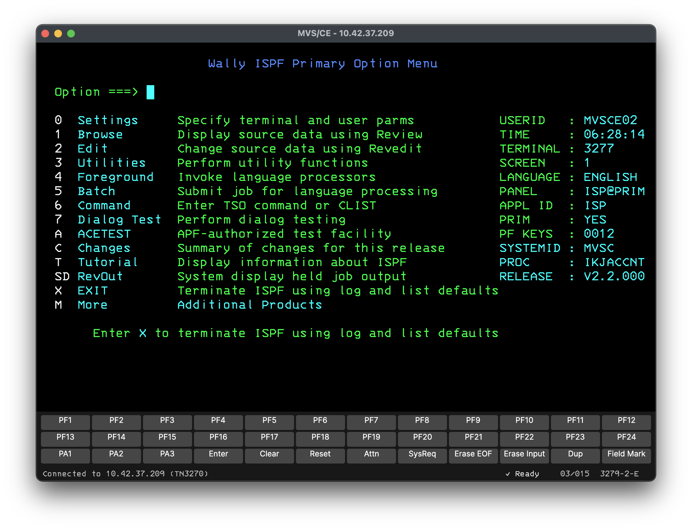

# LizTerm

A TN3270 terminal for retro mainframe hobbyists, on macOS, Linux and Windows. Connect to MVS 3.8j (TK4-, TK5,
MVS/CE), VM/370 or z/OS over plain TN3270 or TLS, log on, work in TSO or CMS, and move files with IND$FILE — in one
consistent app on every platform, with nothing else to install.

LizTerm's emulation comes from `b3270`, part of the long-established x3270 suite, which every build bundles.
LizTerm is the modern client around it.

## The name

LizTerm is named after Liz, a beloved cat who passed away in December 2021. She liked to sit on my desk beside the
keyboard while I worked. She was my mainframe cat.

## Features

- **One app, six builds**: macOS (Apple Silicon and Intel), Linux (x64 and ARM64) and Windows (x64 and ARM64), each
  self-contained.
- **Session profiles** for your hosts, or **Quick Connect** to try a host without saving one.
- **TLS**, with certificate verification against your system's trusted roots, and **certificate pinning** for the
  self-signed certificates most hobbyist hosts use.
- **IND$FILE file transfer** to and from TSO, VM/CMS and CICS, with progress and cancel.
- **Models 2 to 5**, custom oversize screens, extended colour, and 41 host code pages.
- **A Vista TN3270-style keyboard**, rectangular selection, and margin-aware paste.
- **An on-screen keypad** for PF1–PF24, PA1–PA3, Attn, Clear, Reset and the rest, docked to the bottom or the
  right of the window.
- **Find on screen**, a **crosshair** cursor, and **screen capture** to text or HTML.
- **A bell** you can see, hear, or both.
- **Keep-alive** and **automatic reconnect**.
- **Preferences** for the crosshair, cursor blink, the bell, the keypad, and — on macOS — whether the menu is
  the system menu bar, the one inside the window, or both.
- The **IBM 3270 font**, on the screen and in the status bar.

## Where LizTerm is right now

LizTerm is pre-1.0. Settings, profile file formats, defaults and interfaces may change between releases.

The 3270 emulation is **not new code**. It is `b3270`, from the long-established x3270 suite, which every build
bundles. That part of the stack is mature, and it is not where the risk is. What is new is the client around it —
the window, profiles, settings, the file-transfer interface and the packaging. Expect the terminal session itself
to be solid, and rough edges in the application surrounding it.

If you find one, please [open an issue](https://github.com/coffeemuse/LizTerm/issues).

## Download

Get the latest build from the [Releases page](https://github.com/coffeemuse/LizTerm/releases/latest). The **ZIP**
for your platform is the simplest choice: unpack it and run LizTerm. The installers beside it are the same app, for
people who prefer one.

| Platform | Archive | Installer |
|---|---|---|
| macOS, Apple Silicon | `LizTerm-osx-arm64-<version>.zip` | `.dmg` |
| macOS, Intel | `LizTerm-osx-x64-<version>.zip` | `.dmg` |
| Linux x86-64 | `LizTerm-linux-x64-<version>.zip` | `.deb`, `.rpm` |
| Linux ARM64 | `LizTerm-linux-arm64-<version>.zip` | `.deb`, `.rpm` |
| Windows x64 | `LizTerm-win-x64-<version>.zip` | `.exe` |
| Windows ARM64 | `LizTerm-win-arm64-<version>.zip` | `.exe` |

Inside each ZIP the app is `LizTerm.app` on macOS, `LizTerm.App` on Linux, and `LizTerm.App.exe` on Windows. Linux
builds need glibc 2.28 or newer, the same floor as .NET 10 itself; musl distributions such as Alpine are not
supported. Windows ARM64 builds bundle the x64 b3270 engine, which runs under Windows 11's x64 emulation; the app
itself is native ARM64.

## First run

**macOS** builds are signed and notarized by Apple, so LizTerm opens like any other app you download. The first
time, macOS may ask you to confirm that you want to open something downloaded from the internet.

**Windows**: SmartScreen warns that the publisher is unknown. Choose **More info**, then **Run anyway**.

## Getting started

1. Open LizTerm. After the splash screen you'll see the **Sessions** list.
2. Choose **New...**, give the profile a name, and enter the host and port. Tick **Use TLS** if the host needs it,
   then **Save**.
3. Select the profile and choose **Connect**.

To try a host without saving a profile, type its address into the **Quick Connect** box — for example
`mvs.example.org`, `192.168.1.10:3270`, or `L:mvs.example.org` for TLS. Once connected, **File > Save as Profile...** keeps it.

If your host uses a self-signed certificate, as most hobbyist hosts do, LizTerm asks what to do the first time. See
[TLS and certificates](docs/user-guide.md#tls-and-certificates).

A few keys to know straight away:

- **Escape is Attn**, not Reset. **Reset** is a tap of the Left Ctrl key, or Ctrl+R.
- **Clear** is Pause, or Ctrl+Escape.
- **F1–F12** are PF1–PF12; add Shift for PF13–PF24.

The [user guide](docs/user-guide.md) has the full keyboard map and everything else.

## Reporting a problem

Please [open an issue](https://github.com/coffeemuse/LizTerm/issues). A wire log helps a lot: turn on
**Help > Wire Log** in the session window, reproduce the problem, turn it off, and attach the file
(**Help > Show Wire Logs...** opens the folder). **A wire log records everything you type, including passwords**, so
check it before you share it.

## License

LizTerm is open source under the BSD 3-Clause License, Copyright 2026 by CoffeeMuse. See [LICENSE](LICENSE).

It bundles:

- **x3270 / b3270**: BSD-3-Clause, Copyright Paul Mattes and others.
- **The IBM 3270 font** by Ricardo Banffy: SIL Open Font License 1.1
  ([licence](src/LizTerm.App/Assets/Fonts/LICENSE-3270font.txt)).
- **Avalonia** and **CommunityToolkit.Mvvm**: MIT.

Their notices are in [THIRD-PARTY-NOTICES.txt](THIRD-PARTY-NOTICES.txt). Every build shows LizTerm's licence and
these notices in full under **About LizTerm** — in a session window's Help menu, or the LizTerm menu on macOS.

## Documentation

- [User guide](docs/user-guide.md): keyboard, profiles, TLS, file transfer, screen capture, wire logs.
- [Development](docs/development.md): building from source, tests, conventions.
- [Engines](docs/engines.md): how the bundled b3270 is built and verified.
- [CI and release](docs/ci-and-release.md): workflows, packaging, signing.
- [Architecture](docs/architecture.md): how the pieces fit together.
